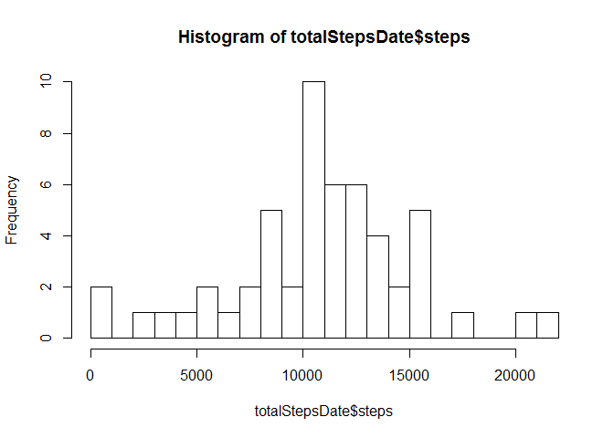
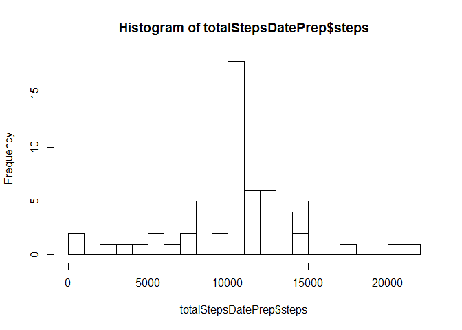

# Reproducible Research: Peer Assessment 1
Harm Lammers  
15 juni 2016  


## Loading and preprocessing the data
The data for this assignment can be downloaded from the course web site:
Dataset: Activity monitoring data [52K]
https://d396qusza40orc.cloudfront.net/repdata%2Fdata%2Factivity.zip


The variables included in this dataset are:  
- steps: Number of steps taking in a 5-minute interval (missing values are coded as NA)  
- date: The date on which the measurement was taken in YYYY-MM-DD format  
- interval: Identifier for the 5-minute interval in which measurement was taken  

The dataset is stored in a comma-separated-value (CSV) file and there are a total of 17,568 observations in this dataset.  


```r
setwd("C:/AA Bestanden/MOOC Data Science - Reproducible research/Assignment repdata data activity/RepData_PeerAssessment1")
activity <- read.csv("activity.csv")
summary(activity)
```

```
##      steps                date          interval     
##  Min.   :  0.00   2012-10-01:  288   Min.   :   0.0  
##  1st Qu.:  0.00   2012-10-02:  288   1st Qu.: 588.8  
##  Median :  0.00   2012-10-03:  288   Median :1177.5  
##  Mean   : 37.38   2012-10-04:  288   Mean   :1177.5  
##  3rd Qu.: 12.00   2012-10-05:  288   3rd Qu.:1766.2  
##  Max.   :806.00   2012-10-06:  288   Max.   :2355.0  
##  NA's   :2304     (Other)   :15840
```
  

## What is mean total number of steps taken per day?
For this part of the assignment, you can ignore the missing values in the dataset.  
1. Make a histogram of the total number of steps taken each day  
2. Calculate and report the **mean** and **median** total number of steps taken per day  


```r
totalStepsDate <- aggregate(steps ~ date, data = activity, sum, na.rm = TRUE)

hist(totalStepsDate$steps, breaks = 20)
```

<!-- -->

```r
a10   <- mean(totalStepsDate$steps)
a11   <- median(totalStepsDate$steps)
```
  
The **mean** total number of steps taken per day   = 1.0766189\times 10^{4}   
The **median** total number of steps taken per day = 10765    
  
## What is the average daily activity pattern? 
  
1. Make a time series plot (i.e. `type = "l"`) of the 5-minute interval (x-axis) and the average number of steps taken, averaged across all days (y-axis)  
2. Which 5-minute interval, on average across all the days in the dataset, contains the maximum number of steps?  
  

```r
meanStepsInterval <- aggregate(steps ~ interval, data = activity, mean, na.rm = TRUE)

plot(steps ~ interval, data = meanStepsInterval, type = "l")
```

<!-- -->

```r
a20   <- meanStepsInterval[which.max(meanStepsInterval$steps), ]$interval
a21   <- meanStepsInterval[which.max(meanStepsInterval$steps), ]$steps
```
  
The 5-minute interval starting at **835** contains the maximum number of steps on average: **206.1698113**.  
  
## Imputing missing values

Note that there are a number of days/intervals where there are missing values (coded as `NA`). The presence of missing days may introduce
bias into some calculations or summaries of the data.  
  
1. Calculate and report the total number of missing values in the dataset (i.e. the total number of rows with `NA`s)  
  

```r
a30   <- sum(is.na(activity$steps))
```
  
The total number of missing values in the dataset : **2304**. 
  
2. Devise a strategy for filling in all of the missing values in the dataset. The strategy does not need to be sophisticated. For example, you could use the mean/median for that day, or the mean for that 5-minute interval, etc.  
  
I choose to use the 5-minute interval mean as an aproximation of the missing value.  
These means have previously been calculated in meanStepsInterval in order to derive the interval with on average the most steps. 
First define a function to retrieve the mean for a specific interval.  
  

```r
interval2meanSteps <- function(interval) 
   {
    meanStepsInterval[meanStepsInterval$interval == interval, ]$steps
   }
```
  
3. Create a new dataset that is equal to the original dataset but with the missing data filled in.  
  

```r
activityPrepared  <- activity                # Create a new dataset with the original data  
countMissing      = 0                        # Count : the number of missing values that will be replaced  

for (i in 1:nrow(activityPrepared))          # search for missing values in each row
   {                                         
    if (is.na(activityPrepared[i, ]$steps))  # when missing, retrieve the mean for the corresponding interval and insert this value
       {
        activityPrepared[i, ]$steps <- interval2meanSteps(activityPrepared[i, ]$interval)
        countMissing = countMissing + 1      # count the missing values that have been replaced
       } # end if                                    
   } # end loop
```
  
**2304** NA values have been replaced by their interval mean.
  
  
4. Make a histogram of the total number of steps taken each day and Calculate and report the **mean** and **median** total number of steps taken per day. 


```r
totalStepsDatePrep <- aggregate(steps ~ date, data = activityPrepared, sum, na.rm = TRUE)

hist(totalStepsDatePrep$steps, breaks = 20)
```

<!-- -->

```r
a40   <- mean(totalStepsDatePrep$steps)
a41   <- median(totalStepsDatePrep$steps)
```
  
The **mean** total number of steps taken per day   = 1.0766189\times 10^{4}   
The **median** total number of steps taken per day = 1.0766189\times 10^{4}    
  
Do these values differ from the estimates from the first part of the assignment? What is the impact of imputing missing data on the estimates of the total daily number of steps?  
  
The mean isn't affected by this data preparation, for we imserted the interval-mean for any missing-value.  
The median has changed slightly (and proves to be the same as the mean), but the effect is dependent on which values are missing.  
  
## Are there differences in activity patterns between weekdays and weekends?
  
First we have to discriminate between weekdays and weekends.  
Create a new factor variable in the dataset with two levels - "weekday" and "weekend" indicating whether a given date is a weekday or weekend day.  

```r
activityPrepared$day = ifelse(as.POSIXlt(as.Date(activityPrepared$date))$wday%%6 == 
    0, "weekend", "weekday")
# For Sunday and Saturday : weekend, Other days : weekday
activityPrepared$day = factor(activityPrepared$day, levels = c("weekday", "weekend"))
```
  
Make a panel plot containing a time series plot (i.e. type = "l") of the 5-minute interval (x-axis) and the average number of steps taken, averaged across all weekday days or weekend days (y-axis). See the README file in the GitHub repository to see an example of what this plot should look like using simulated data.  
  
  

```r
meanStepsInterval2 <- aggregate(steps ~ interval + day, data = activityPrepared, mean)

library(lattice)
xyplot(steps ~ interval | factor(day), data = meanStepsInterval2, aspect = 1/2, type = "l")
```

<!-- -->

These observations lead to the conclusion that in a dutch setting, during weekdays there's an early start and a lot of (commuting) activity.
On weekends there's a tendency to wake up later, widely spread over the morning, and have more activities during daytime. I would say we have a white collar worker / scholar at hand, but that's sheer interpretation :-).  
  
